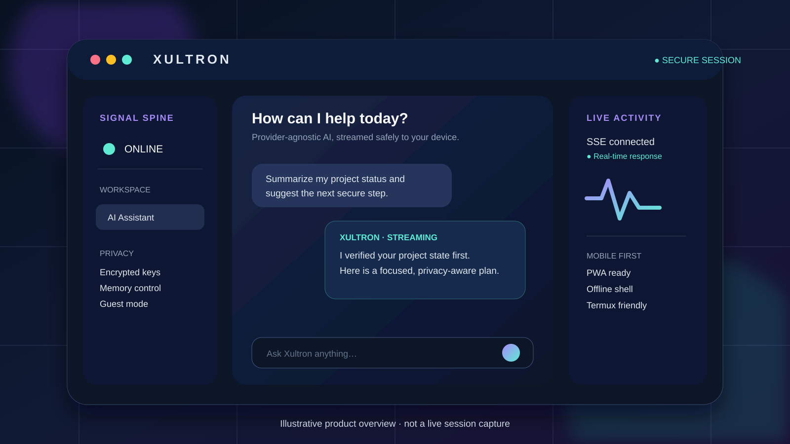
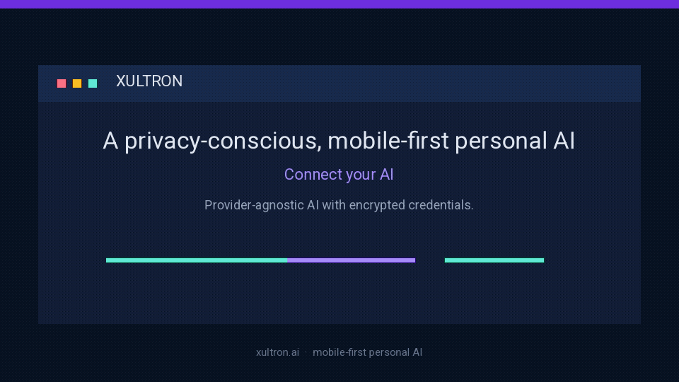

# Xultron

> **Mobile-first personal AI, built for privacy, portability, and real-time work.**
> [Türkçe README](README.tr.md)

<p align="center">
  
</p>

<p align="center">
  
</p>

<p align="center"><sub>The overview assets are illustrative product visuals, not a live user-session capture.</sub></p>

[](LICENSE)
[](frontend/)
[](https://github.com/trackview1827-ctrl/Xultron/releases)
[](https://www.npmjs.com/package/xultron-ai)

Xultron is a provider-agnostic personal AI system with a React and TypeScript PWA, a Flask REST/SSE API, encrypted provider credentials, user-controlled memory, and an Android WebView shell. It is designed to work well on desktop, mobile, and Termux while keeping control of data with the user.

## Why Xultron

| Capability | What it means |
| --- | --- |
| **Secure AI access** | Provider credentials are encrypted with Fernet and only masked feedback is displayed. |
| **Real-time answers** | Server-Sent Events stream model output while idempotent requests and network recovery protect the conversation. |
| **Mobile first** | A React, TypeScript, Vite, and Tailwind PWA ships with an offline app shell, manifest, and service worker. |
| **User-controlled data** | Personal memory is searchable and controllable. Guest mode keeps a separate, isolated experience. |
| **Voice and devices** | Browser microphone, STT, TTS, Bluetooth, ESP32, and Raspberry Pi boundaries are supported deliberately. |
| **Portable development** | The project supports Linux, macOS, and Termux. A native Android container runs the shared web frontend. |

## Product demo

A locally runnable demo is the supported demonstration path. It uses the actual Flask backend and PWA, rather than a static mockup:

```bash
make setup
make serve
# Open http://127.0.0.1:5000
```

For the full demo flow, including an Android debug-build install path and validation boundaries, see [docs/DEMO.md](docs/DEMO.md). Published Android debug builds are available on the [Releases page](https://github.com/trackview1827-ctrl/Xultron/releases). They are test artifacts, not Play Store releases.

## Quick start

### Requirements

- Python 3.11+
- Node.js 20+
- npm, Git, and `make`
- `pyca/cryptography` for encrypted local provider-key storage

On Termux, install the packaged crypto dependency before creating the virtual environment:

```bash
pkg install git nodejs python python-cryptography
python -m venv --system-site-packages backend/.venv
```

### Run from source

```bash
git clone https://github.com/trackview1827-ctrl/Xultron.git
cd Xultron
make setup
make serve
```

Open **http://127.0.0.1:5000**. In local development, when explicit secrets are absent, the backend creates persistent random secrets in the Git-ignored `backend/instance` directory. In production, set `SECRET_KEY` and `ENCRYPTION_KEY` explicitly.

### Use the CLI

The npm package is named [`xultron-ai`](https://www.npmjs.com/package/xultron-ai) and installs the `xultron` command.

```bash
npm install -g xultron-ai
xultron
```

On a fresh machine, `xultron` clones the app to `~/.xultron/app`, bootstraps it, and starts it. Available commands:

```bash
xultron install  # clone and bootstrap
xultron update   # fast-forward a clean installation
xultron start    # run the installed app
xultron dev      # run development servers
xultron doctor   # check prerequisites
xultron help     # show help
```

To run the repository version directly without waiting for the npm registry:

```bash
npx --yes github:trackview1827-ctrl/Xultron doctor
```

## Architecture

```text
frontend/   React + TypeScript PWA, service worker, UI, voice client
backend/    Flask REST/SSE API, SQLAlchemy data layer, migrations
android/    Native Android WebView container and secure mobile integration
cli/        Zero-dependency installer and launcher published as xultron-ai
docs/       Product, API, architecture, security, demo, and validation docs
scripts/    Local setup, development, smoke-test, and cleanup helpers
```

The frontend streams chat through SSE. The backend maintains provider abstractions for AI, STT, and TTS. Native Android capabilities are scoped behind explicit permission and origin checks. See [docs/ARCHITECTURE.md](docs/ARCHITECTURE.md) and [docs/API_CONTRACT.md](docs/API_CONTRACT.md) for details.

## Development

```bash
# Terminal 1: API
cd backend
.venv/bin/python run.py

# Terminal 2: PWA dev server
npm --prefix frontend run dev
```

### Quality commands

```bash
npm test                              # CLI tests
npm --prefix frontend run typecheck   # TypeScript
npm --prefix frontend test            # PWA tests
make test                             # backend + frontend tests
make build                            # production PWA build
make smoke                            # isolated production smoke flow
```

For an Android debug candidate, use a machine with the Android SDK configured:

```bash
cd android
./gradlew test lint assembleDebug --stacktrace
sha256sum app/build/outputs/apk/debug/app-debug.apk
```

## Documentation

- [Demo and Android builds](docs/DEMO.md)
- [Architecture](docs/ARCHITECTURE.md)
- [API contract](docs/API_CONTRACT.md)
- [UI system](docs/UI_SYSTEM.md)
- [Acceptance matrix](docs/ACCEPTANCE.md)
- [Validation report](docs/VALIDATION_REPORT.md)
- [Security policy](SECURITY.md)
- [Contributing and commit conventions](CONTRIBUTING.md)

## Security and privacy

Do not commit `.env` files, API keys, generated `backend/instance` secrets, Android signing keys, or personal data. Review [SECURITY.md](SECURITY.md) before reporting a vulnerability or configuring a production deployment.

## License

Xultron is released under the [MIT License](LICENSE).
